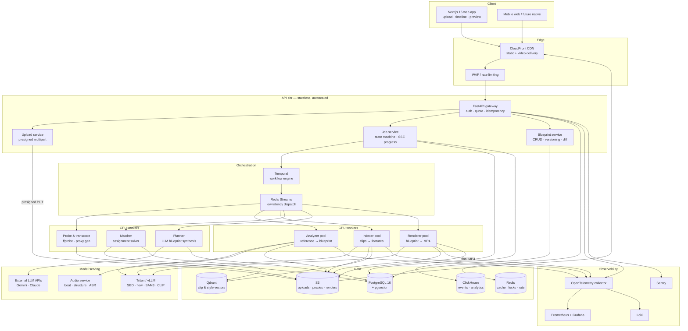
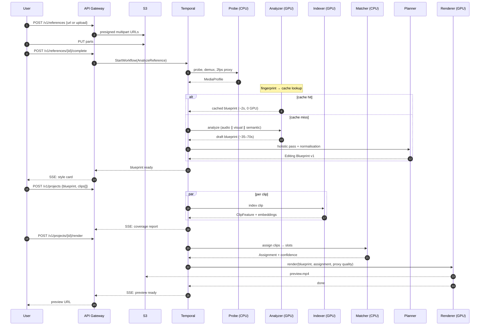
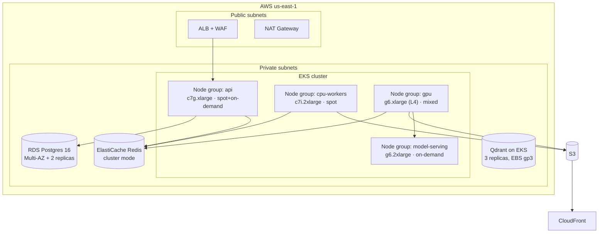

# 03 — System Architecture

## 1. Architectural principles

Five constraints drive every structural decision below. Each is stated with the design consequence it forces.

**1. GPU minutes are the only cost that matters.** At scale, GPU dominates COGS by an order of magnitude over everything else combined. Consequence: GPU work is isolated into dedicated worker pools with independent autoscaling, aggressive caching, and batch-friendly interfaces. No GPU worker ever blocks on a network call to a service that could be slow.

**2. Reference analysis is cacheable; render is not.** The same reference video analysed twice must produce the same blueprint and cost GPU once, ever. Consequence: content-addressed reference identity (perceptual hash + duration + audio fingerprint), and a blueprint cache that is a first-class datastore rather than a Redis afterthought.

**3. The render path is deterministic and contains no sampling.** Consequence: LLMs live in the *planner*, upstream of the blueprint. Once a blueprint exists, everything downstream is a pure function of `(blueprint, assets, renderer_version)`.

**4. Every stage is independently retryable and independently versioned.** Video pipelines fail constantly — corrupt uploads, unusual codecs, OOM on a 4K 60fps clip, a model server restarting. Consequence: durable job state in Postgres, not in a queue; idempotent stage handlers keyed by `(job_id, stage, attempt_input_hash)`; per-stage artefacts persisted to object storage so a failed stage 6 does not re-run stages 1–5.

**5. User-perceived latency is budgeted, not hoped for.** Consequence: explicit latency budgets per stage ([docs/05](05-data-flow.md)), work reordered so the user sees the style card before user-footage indexing finishes, and progressive preview rendering (low-res proxy first).

## 2. System overview



## 3. Service responsibilities

### 3.1 API tier — `services/api`

Stateless FastAPI, horizontally scaled behind an ALB. Never touches a GPU, never blocks on video work, p99 under 120ms for every route.

| Component | Responsibility | Notes |
|---|---|---|
| **Gateway** | AuthN/Z, rate limit, quota check, idempotency, request validation | JWT via Auth0/Clerk; org-scoped RBAC |
| **Upload** | Issue presigned S3 multipart URLs; register asset rows; kick off probe | Bytes never transit the API. Non-negotiable at scale. |
| **Job** | Create/read jobs, expose the state machine, stream progress via SSE | Job state lives in Postgres; SSE reads from a Redis pubsub fanout |
| **Blueprint** | Read/write/version/diff blueprints; validate against JSON Schema | Every user edit creates a new immutable version with a parent pointer |

**Idempotency.** Every mutating endpoint accepts `Idempotency-Key`. We store `(key, org_id, request_hash) → response` in Redis for 24h. Replay with a matching hash returns the cached response; replay with a different hash returns `409`. Detail in [docs/12 §6](12-api-design.md).

### 3.2 Orchestration — Temporal + Redis Streams

A two-layer split, because these are two different problems.

**Temporal** owns *workflow durability*: the multi-minute, multi-stage, failure-prone journey of a job. It gives us durable timers, automatic retry with per-stage backoff policy, compensation on cancel, and — most valuably — the ability to deploy new worker code mid-flight without losing in-progress jobs. Writing this correctly by hand against SQS costs six months and we would still get replay-after-crash wrong.

**Redis Streams** owns *low-latency dispatch* to GPU workers, with consumer groups per pool and per-priority streams (`render:p0` interactive preview, `render:p1` export, `render:p2` batch/API). Temporal activities enqueue onto Redis; workers claim with `XAUTOCLAIM` so a crashed worker's message is reclaimed after a visibility timeout rather than lost.

Why not just Temporal activities directly on the GPU workers? Because GPU workers need to control their own batching and admission — a worker with 24GB VRAM decides for itself whether it can take another 4K job. A pull model with explicit claim gives the worker that control; a push model does not.

### 3.3 GPU worker pools

Three pools, separately scaled, because their resource profiles are genuinely different:

| Pool | Job shape | GPU | VRAM driver | Scaling signal |
|---|---|---|---|---|
| **Analyzer** | Bursty, 35–70s, one reference | L4 / A10G | Video-LLM context + SBD | Reference queue depth |
| **Indexer** | Highly parallel, 2–6s per clip, batchable | L4 | Batch size × CLIP/SAM | Clip queue depth |
| **Renderer** | Long, 40–180s, memory-heavy | L4 (1080p) / A10G (4K) | Frame buffers + shader passes | Weighted queue depth by output pixels |

**Why L4 as the default.** It has hardware NVENC/NVDEC (essential — software encode would double render cost), 24GB VRAM, and the best perf-per-dollar for this mix. A100/H100 are wrong here: we are not compute-bound on large matmuls, we are bound on video codec throughput and moderate-size vision models. Paying H100 prices for NVDEC would be an unforced margin error.

**Autoscaling.** KEDA against Redis Stream depth, scaled by *estimated GPU-seconds in queue* rather than message count — a 4K 90-second render and a 720p 15-second preview are not the same unit. Scale-up is aggressive (30s stabilisation), scale-down is conservative (5min) because cold-starting a GPU node with model weights takes 60–90s even with a warm image cache.

**Model weight loading.** Weights live on a read-only EFS/FSx volume mounted into every GPU node and are `mmap`ed. Baking them into the container image would produce 40GB+ images and destroy deploy velocity. Node-local NVMe caches the hot set.

### 3.4 Model serving — `TRT`

Vision models run behind **Triton Inference Server** in a separate deployment from the workers. This separation is deliberate:

- Workers scale on *job* demand; model servers scale on *inference* demand. These decorrelate — an indexer batch of 40 clips is one job and 40 inferences.
- Triton gives dynamic batching for free, which roughly triples throughput on CLIP-class models at our request sizes.
- Model version rollout becomes independent of worker rollout, so we can canary a new shot-boundary detector without redeploying the analyzer.

Language models split by role:

- **Open-weight VLM** (Qwen2.5-VL / InternVL3.5-class) on vLLM for high-volume, low-stakes labelling: shot description, scene category, subject tagging. Runs on our GPUs, cost per call ≈ 0.
- **Frontier API** (Gemini 2.5/3-class) for the planner's holistic reasoning pass — the "why did the editor make these choices, and how should they adapt to different footage" question — where quality difference is worth the per-call cost. Called once per *unique reference*, not per job, so the cache makes it cheap.

### 3.5 Data stores

| Store | Holds | Why this one |
|---|---|---|
| **PostgreSQL 16 + pgvector** | Users, orgs, assets, jobs, blueprints, styles, entitlements | Transactional integrity for billing and job state. pgvector handles small/medium ANN without a second system in year one. |
| **Qdrant** | Clip embeddings, style embeddings, music embeddings | At >50M vectors pgvector's recall/latency curve degrades. Qdrant does filtered ANN (`org_id`, `shot_scale`, `motion_class`) natively — and our matcher queries are *always* filtered. |
| **Redis** | Idempotency, rate limits, SSE fanout, distributed locks, hot blueprint cache | Latency. Also the Streams broker. |
| **S3** | Uploads, proxies, per-stage artefacts, renders | Lifecycle policies do the cost management (see below) |
| **ClickHouse** | Events, render telemetry, swap logs, funnel analytics | Swap logs are the matcher's training data and arrive at high volume. Postgres would buckle; ClickHouse is built for it. |

**S3 lifecycle — where storage cost is actually controlled:**

```
Originals    Standard 30d → IA 60d → Glacier IR 275d → delete at 365d
Proxies      Standard 7d  → delete            (regenerable in seconds)
Artefacts    Standard 14d → delete            (regenerable by re-running a stage)
Renders      Standard 30d → IA → delete at 180d unless in an active project
Blueprints   Standard, forever                 (kilobytes; the crown jewels)
```

Blueprints are never deleted. They are tiny, they are the corpus, and they are the reason the company is worth something.

## 4. Job orchestration flow



## 5. GPU worker internals

Every GPU worker is the same shape. Uniformity here is worth more than per-worker optimisation — it makes the fleet debuggable.

```
┌─────────────────────────────────────────────────────────────┐
│ GPU Worker Process                                          │
│                                                             │
│  ┌───────────────┐   claims from Redis Stream by priority   │
│  │ Admission     │   admits only if VRAM headroom ≥ estimate│
│  │ controller    │   → prevents OOM instead of recovering   │
│  └───────┬───────┘                                          │
│          ▼                                                  │
│  ┌───────────────┐   NVDEC hardware decode → CUDA surfaces  │
│  │ Decode stage  │   zero host round-trip via CUDA-GL interop│
│  └───────┬───────┘                                          │
│          ▼                                                  │
│  ┌───────────────┐   stage-specific: inference, filter      │
│  │ Compute stage │   graph, or shader passes                │
│  └───────┬───────┘                                          │
│          ▼                                                  │
│  ┌───────────────┐   NVENC hardware encode (renderer only)  │
│  │ Encode stage  │                                          │
│  └───────┬───────┘                                          │
│          ▼                                                  │
│  ┌───────────────┐   artefact → S3, heartbeat → Temporal    │
│  │ Emit + ack    │   ack only after durable write           │
│  └───────────────┘                                          │
│                                                             │
│  Sidecars: OTel exporter · DCGM GPU metrics · health probe  │
└─────────────────────────────────────────────────────────────┘
```

Two details that matter more than they look:

**Admission control before claim, not after.** The worker estimates VRAM for a job from its declared resolution, duration and effect count, and refuses to claim if headroom is insufficient. Handling OOM after the fact means a half-rendered job, a corrupted CUDA context, and usually a process restart. Refusing up front means the message stays in the stream for a bigger worker.

**Zero host round-trips.** Decode → process → encode stays in device memory via CUDA-GL interop. Copying 1080p60 frames to host and back costs more wall-clock than most of the actual processing, and it is the single easiest way to accidentally triple render cost.

## 6. Deployment topology



**Why EKS rather than serverless GPU (Modal, Replicate, RunPod).** We will use serverless GPU for burst overflow and for the first six months — it is unquestionably the right call before product-market fit, because it removes an entire operational surface. But steady-state at scale it costs 2.5–4× reserved capacity, and once GPU is 60% of COGS that difference *is* the gross margin. The architecture keeps the worker interface identical in both cases (claim from Redis, write to S3), so the migration is a deployment change and not a rewrite. Concretely: serverless until ~500 GPU-hours/day, then hybrid with reserved baseline plus serverless spike.

**Spot instances.** CPU workers and roughly 60% of GPU capacity run on spot with on-demand fallback. Because Temporal makes every stage retryable, a spot interruption costs one re-run of one stage, not a failed job. This is a concrete case where the durability investment pays for itself in dollars.

## 7. Caching strategy

Caching is not an optimisation here; it is the business model. The economics in [docs/14](14-cost-model.md) assume the numbers below.

| Cache | Key | Hit rate (est.) | Saves |
|---|---|---|---|
| **Blueprint** | `sha256(phash_seq ‖ duration ‖ audio_fp)` | 55–75% steady state | 35–70s GPU per hit |
| **Clip features** | `sha256(file_bytes) ‖ indexer_version` | 25–40% | 2–6s GPU per clip |
| **Music analysis** | `track_id ‖ analyzer_version` | ~100% after warm | Full audio pass |
| **Render** | `sha256(blueprint ‖ assignment ‖ assets ‖ renderer_version)` | 10–20% | Entire render |
| **Proxy** | `asset_id ‖ profile` | High | Transcode |

The blueprint cache hit rate is the single most important number in the company's cost model. It is high because reference selection follows a power law — creators reference the same viral videos. **A cache hit is a job that costs us ~$0.01 instead of ~$0.40.** [docs/00](00-executive-summary.md#what-has-to-be-true) lists it as a week-18 validation item with a kill criterion for exactly this reason.

**Version keys are mandatory in every cache key.** When we ship a better shot-boundary detector, every cached blueprint produced by the old one must miss. Omitting the version key produces the worst class of bug in this system: silently stale output that nobody notices for weeks.

## 8. Security & tenancy

- **AuthN:** OIDC via Clerk (fastest path; swappable). Short-lived JWTs, refresh rotation.
- **AuthZ:** org-scoped RBAC checked in the gateway *and* enforced by Postgres row-level security. Belt and braces — the second layer is what saves you when a query in a worker forgets a `WHERE org_id`.
- **Asset isolation:** S3 keys are `{org_id}/{asset_id}/...` with bucket policies denying cross-prefix access; workers get scoped STS credentials per job, valid for the job's TTL only.
- **Encryption:** TLS 1.3 in transit; SSE-KMS at rest with per-org keys on Enterprise.
- **Secrets:** AWS Secrets Manager, IRSA for pod identity, zero long-lived credentials in the cluster.
- **Network:** private subnets, no public IPs on workers, VPC endpoints for S3 (also saves NAT egress cost, which is not trivial at video volumes).
- **Supply chain:** pinned digests, SBOM per image, Trivy in CI, signed images via cosign.
- **Content safety:** moderation runs at upload, before any GPU spend, and again pre-publish. See [docs/18 §8](18-legal-ethics.md).

## 9. Observability

Three questions the system must answer at 3am, and the instrumentation that answers them:

**"Why is this job slow?"** — Distributed tracing (OpenTelemetry) with a span per stage, propagated through Temporal and Redis via trace context in the message headers. GPU spans carry `gpu_seconds`, `vram_peak_mb`, `model_versions[]`.

**"Are we losing money on this job?"** — Every job row accumulates a cost ledger: GPU seconds by pool, external API tokens, S3 bytes written, egress bytes. Rolled up hourly into ClickHouse. Margin per job is a query, not a spreadsheet exercise.

**"Did quality regress?"** — Golden-set regression: 200 fixed reference videos re-analysed on every analyzer deploy, blueprints diffed structurally against the known-good baseline. Cut-count drift >5%, transition-class distribution shift, or grade parameter drift beyond tolerance blocks the deploy. Detail in [docs/16](16-risks.md).

| Signal | Tool | Key alerts |
|---|---|---|
| Metrics | Prometheus + Grafana | GPU util <55% (waste) or >92% (starvation); queue depth by priority; cache hit rate by type |
| Traces | OTel → Tempo | p95 stage latency vs. budget ([docs/05](05-data-flow.md)) |
| Logs | Loki | Structured JSON, `job_id` on every line |
| Errors | Sentry | Grouped by stage and model version |
| Product | ClickHouse + Metabase | Funnel, swap rate, coverage-warning → churn correlation |
| Cost | ClickHouse | Cost-per-render trend; alert on 20% WoW increase |

## 10. Failure modes and responses

| Failure | Blast radius | Response |
|---|---|---|
| GPU node dies mid-render | 1 job | Temporal retries stage on another node; ≤1 stage lost |
| Spot fleet reclaimed | Queue backs up | On-demand fallback node group scales; p2 batch work sheds first |
| Model server OOM | Inference errors across pool | Admission control caps concurrency; circuit breaker → degraded model tier |
| Frontier LLM API down | Planner degraded | Fall back to open-weight VLM planner; blueprint flagged `planner_tier=fallback` |
| Postgres primary failover | ~30s write outage | Multi-AZ automatic; API returns 503 with `Retry-After`; Temporal absorbs it |
| Corrupt/unusual upload | 1 asset | Probe rejects with a *specific* message before any GPU spend |
| Poison-pill job crashes workers | Whole pool | 3-strike rule → job quarantined to a dead-letter stream, alert raised |
| Runaway cost from a bug | Financial | Hard per-org and global GPU-second budget; breaker trips and pages |

The last row is not paranoia. The classic failure in this category is a retry loop that re-renders a 4K job five hundred times overnight. A global GPU-second circuit breaker is cheap to build and has a very high expected value.

---

Next: [04 — AI Pipeline](04-ai-pipeline.md)
