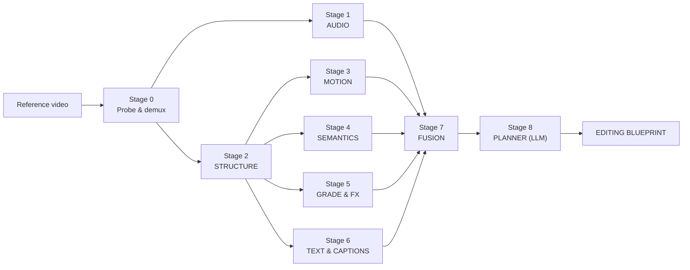

# 04 — AI Pipeline

The pipeline has two halves that meet in the middle:

```
REFERENCE VIDEO ──► [ Analysis ] ──► EDITING BLUEPRINT ──┐
                                                          ├──► [ Matcher ] ──► [ Renderer ] ──► OUTPUT
USER CLIPS ────────► [ Indexing ] ──► CLIP FEATURE SET ───┘
```

The two halves must produce features in a **shared vocabulary**. If the reference analyser labels shot scale as `{close, medium, wide}` and the clip indexer labels it as a continuous subject-area ratio, matching becomes guesswork. Every attribute in this document exists in exactly one canonical form, defined in [`services/common`](../services/common/) and enforced by the schema in [docs/06](06-blueprint-spec.md).

---

## Part A — Reference analysis

Runs once per unique reference, ever. Cached by content fingerprint ([docs/03 §7](03-system-architecture.md#7-caching-strategy)). Budget: **≤75s wall-clock cold**.



Stages 1–6 run in parallel on the same decoded frame stream. Stage 2 must finish before 3–6 because they operate per-shot.

### Stage 0 — Probe & demux

`ffprobe` for container, codec, resolution, frame rate (and whether it is *variable*, which breaks naive timestamp maths), rotation metadata, colour primaries, transfer characteristics, and pixel format. HDR references are tone-mapped to SDR for analysis with the mapping recorded, so a Pro user can later re-target HDR.

Outputs three derived streams:
- **Analysis proxy** — 512px long edge, 2 fps, for semantic models
- **Motion proxy** — 256px, full frame rate, for optical flow and cut detection
- **Audio** — 44.1kHz mono WAV plus the original stereo

**Why separate proxies.** Semantic models do not benefit from 60fps; motion analysis is destroyed by 2fps. Running everything at full resolution and frame rate would roughly quadruple analysis cost for no accuracy gain.

**Variable frame rate is the most common source of subtle bugs in this system.** Phone footage is frequently VFR. We normalise to a constant frame rate with an explicit presentation-timestamp map so that "frame 412" means the same instant in every stage.

### Stage 1 — Audio analysis

The single highest-value stage, because rhythm is the backbone of the blueprint.

| Sub-task | Approach | Output |
|---|---|---|
| Source separation | Demucs v4 → drums/bass/vocals/other stems | Stems for downstream tasks |
| Beat & downbeat | Transformer beat tracker (Beat This!-class), DBN fallback | Beat grid, downbeats, time signature |
| Tempo & tempo curve | Per-beat IBI → smoothed BPM curve | BPM, tempo-change points |
| Structure | Self-similarity matrix over CQT + learned boundary detector | Sections: intro/verse/build/drop/chorus/outro |
| Energy envelope | RMS + spectral flux + perceptual loudness (LUFS), 20Hz | Normalised 0–1 energy curve |
| Drop / impact detection | Energy derivative peaks ∧ downbeat ∧ broadband onset | Impact points with strength |
| Mood & genre | Audio embedding (CLAP-class) → classifier | Mood vector, genre tags |
| SFX detection | Onsets on `other` stem not explained by musical structure | SFX events with class + timing |
| Audio transitions | Filter-sweep detection, riser detection, silence gaps | Audio-transition markers |

**Beat tracking choice matters.** Classical DBN post-processing (madmom) assumes a roughly constant tempo and breaks on the tempo changes that make edits interesting. Transformer trackers without DBN post-processing handle time-signature and tempo variation far better, which is precisely the case we care about. We run both and prefer the transformer, using DBN agreement as a confidence signal — where the two disagree, confidence drops and the planner is told to prefer content-driven cuts over grid-driven cuts in that region. ([Beat This! context](https://arxiv.org/pdf/2510.14391), [madmom](https://madmom.readthedocs.io/en/v0.16/modules/features/downbeats.html))

**Why source separation first.** Beat detection on a full mix with loud vocals or heavy sidechain is materially worse than on an isolated drum stem. Demucs costs ~4s on an L4 for 60s of audio and improves everything downstream — beat F-measure, structure boundaries, and SFX isolation.

**Critically:** none of this audio is retained. We keep the *analysis* — grid, sections, energy curve — and discard the waveform after the stage completes. That discard is an explicit, tested step, not an implicit consequence of temp-file cleanup. See [docs/18 §4](18-legal-ethics.md).

### Stage 2 — Structural analysis (shots and transitions)

**Shot boundary detection.** Ensemble of TransNetV2 and an AutoShot-class model. AutoShot outperforms TransNetV2 by ~4.2% on the SHOT dataset (short-form video specifically) and 1.1–1.2% on ClipShots/BBC/RAI — and short-form is exactly our domain. ([AutoShot](https://arxiv.org/abs/2304.06116), [TransNetV2](https://github.com/soCzech/TransNetV2))

We run both and fuse:
- Both agree → boundary, high confidence
- Disagree → resolve with a frame-difference + histogram-distance heuristic at that locus, mark medium confidence
- Gradual transitions → the models give a *range*; we take the range as the transition duration rather than collapsing it to a point

That last item is the reason for the ensemble. A hard cut is a single frame index; a 14-frame cross-dissolve is an interval, and collapsing it loses the transition duration the blueprint needs.

**Transition classification.** Once we have the interval, a classifier determines type, and the feature set is deliberately hand-designed rather than end-to-end, because the classes are physically distinct:

| Class | Discriminating signal |
|---|---|
| Hard cut | Interval length 1 frame; large frame delta |
| Cross dissolve | Linear blend of both frames' histograms across interval |
| Fade to black/white | Luma converges to 0 or 255 monotonically |
| Flash | Brief luma spike above both neighbours, ≤4 frames |
| Whip pan | Extreme unidirectional optical flow + directional motion blur |
| Zoom transition | Radial flow field, divergence-dominated |
| Spin | Curl-dominated flow field |
| Blur transition | Rising high-frequency energy loss without flow |
| RGB split | Channel misregistration measured by per-channel phase correlation |
| Film burn / light leak | Warm-hue overlay energy spike, low spatial frequency |
| Shake | High-magnitude, high-frequency global translation |
| Mask/shape wipe | Coherent moving edge in the difference image |

Each returns `{type, duration_frames, intensity 0–1, direction_deg | null, confidence}`. Multi-label is permitted — a whip pan *is* usually also a motion-blur transition, and the renderer needs both.

**Why not a single end-to-end transition classifier?** We will train one, once we have blueprint-corpus labels. On day one, hand-designed features on physically distinct classes are more accurate, far more debuggable, and produce parameters (duration, intensity, direction) that a classifier would not. The hand-built version also generates the training labels for its own replacement.

### Stage 3 — Motion analysis

Per shot:

| Signal | Method | Used for |
|---|---|---|
| Dense optical flow | SEA-RAFT (accurate) or RAFT-small (fast tier) | Everything below |
| Global camera motion | Fit affine/homography to flow, RANSAC to reject subject motion | Pan/tilt/zoom/roll classification |
| Camera motion class | Decompose the fitted model | `static, pan_l/r, tilt_u/d, zoom_in/out, roll, dolly, handheld, tracking` |
| Motion magnitude curve | Per-frame mean flow magnitude | Speed-ramp detection, cut micro-placement |
| Shake / stabilisation | High-frequency energy in the global motion signal | `handheld` vs `stabilised` vs `gimbal` |
| Subject vs camera motion | Residual flow after removing the global model | Tracking-shot detection |
| Speed anomaly | Compare motion magnitude to the shot's own semantic expectation, plus duplicate-frame and inter-frame-difference analysis | Slow-mo / timelapse / ramp detection |

**Speed detection is the trickiest inference here and deserves honesty.** From a delivered video you cannot directly observe that a shot was shot at 120fps and played at 24. What you observe is: unusually smooth motion for the apparent action, absent motion blur relative to displacement, and sometimes duplicated or interpolated frames. We combine three estimators — motion-blur-to-displacement ratio, temporal-frequency content of the motion signal, and semantic expectation from the VLM ("a person walking should traverse the frame in roughly N seconds") — into a speed factor with a confidence. Below 0.6 confidence we record `speed: 1.0` with a note rather than guessing, because a wrong speed ramp is far more visible in the output than a missing one.

SEA-RAFT is chosen as the accurate tier: it is state-of-the-art for supervised optical flow with strong cross-domain generalisation and is meaningfully cheaper than iterative RAFT at equal accuracy. ([SEA-RAFT](https://dl.acm.org/doi/abs/10.1007/978-3-031-72667-5_3), [model comparison](https://ptlflow.readthedocs.io/en/latest/models/models_list.html))

### Stage 4 — Semantic analysis

What is actually happening in each shot.

**Shot-level VLM pass.** For every shot, sample 4–8 frames and ask an open-weight VLM (Qwen2.5-VL / InternVL3.5-class) for structured output — never free text:

```json
{
  "subject_primary": "motorcycle",
  "subject_secondary": ["rider", "road"],
  "action": "riding",
  "scene_category": "outdoor_road",
  "shot_scale": "medium",
  "camera_height": "low",
  "time_of_day": "golden_hour",
  "weather": "clear",
  "location_type": "rural",
  "emotional_tone": "energetic",
  "narrative_role": "action_beat"
}
```

Constrained decoding against a JSON schema. This is not optional — free-text output from a VLM produces a long tail of near-synonyms (`motorbike`, `motorcycle`, `bike`) that silently destroys matching. The enum is the interface.

**Detection & tracking.** SAM 3 for concept-prompted segmentation and tracking. The step-change over SAM 2 is that a noun phrase returns masks and stable IDs for *every* matching instance at once, rather than one object per geometric prompt — 848M params, detector + tracker sharing one vision encoder. This gives us subject masks for reframing, subject-area ratio for shot scale, and subject trajectories for tracking-shot detection, all zero-shot and without a per-vertical detection model. ([SAM 3](https://ai.meta.com/research/publications/sam-3-segment-anything-with-concepts/), [SAM 3.1](https://ai.meta.com/blog/segment-anything-model-3/))

**Faces.** Detection, landmarks, expression classification, and gaze direction. Face *identity embeddings are computed but never persisted* beyond the job — we need to know "the same person appears in shots 3, 7 and 11" for continuity, and we do not need a face database. See [docs/18 §5](18-legal-ethics.md).

**Shot scale.** Derived, not asked. `subject_area_ratio = mask_area / frame_area`, bucketed with hysteresis:

```
extreme_close  ratio > 0.55
close          0.28 – 0.55
medium_close   0.15 – 0.28
medium         0.07 – 0.15
wide           0.02 – 0.07
extreme_wide   < 0.02
```

Computed geometrically rather than asked of the VLM because it is a measurement, and measurements should be measured. The VLM's own `shot_scale` output is retained only as a cross-check; disagreement lowers confidence.

**Composition.** Rule-of-thirds adherence (subject centroid distance to the four power points), horizon angle, symmetry score (left-right mirror correlation), negative-space fraction, and leading-line detection via Hough transform. These matter for matching — a reference shot composed with the subject hard left and negative space right should ideally map to a user clip with the same composition, because that is what makes cuts feel deliberate.

### Stage 5 — Colour grade and effects

**This is the stage where the industry over-claims, so read [docs/08 §5](08-algorithms.md#5-colour-grade-inversion) for the full treatment.** The summary:

You cannot recover the reference's LUT. You are looking at a video that has been graded, then encoded with lossy compression that quantised chroma to 4:2:0 and threw away exactly the fine colour detail a LUT inversion would need. The original camera-native footage is not available, so there is no "before" to compare the "after" against. It is an inverse problem with the input missing.

What we *can* do, and do:

1. **Measure the delivered look.** Per-shot and global histograms in RGB and Lab; luma percentiles (black point, shadows, mids, highlights, white point); saturation distribution; the hue-vs-hue and hue-vs-saturation curves; and the *split-tone signature* — mean hue of the darkest 15% versus the brightest 15% of pixels, which is the single most recognisable element of most short-form grades.

2. **Fit a parametric grade** — lift/gamma/gain per channel, contrast pivot, HSL qualifier adjustments, and a split-tone pair — by optimising to match the reference's colour statistics. This produces something applicable to *any* footage, which a recovered LUT would not be anyway.

3. **Extract a palette** via k-means in Lab with perceptual weighting, kept as style metadata and used for caption-colour selection and for matching.

4. **Report confidence honestly.** Heavily compressed, low-bitrate references get low confidence, and the UI says "approximate grade" instead of implying precision we do not have.

**Effect detection.** Each effect gets a detector producing presence, strength, and parameters:

| Effect | Detection signal |
|---|---|
| Film grain | Noise power spectral density in flat regions after denoising; grain size from autocorrelation |
| Vignette | Radial luma falloff fitted as a function of normalised radius |
| Chromatic aberration | Per-channel radial displacement measured at high-contrast edges |
| Glow / bloom | Halo energy around highlights above a luma threshold |
| Blur (intentional) | Local frequency analysis vs. the shot's sharpest region — distinguishes stylistic blur from focus miss |
| Sharpen | Overshoot/undershoot ringing at edges |
| VHS / CRT | Scanline periodicity, chroma bleeding, characteristic noise pattern |
| Light leak / film burn | Low-frequency warm gradient from a frame edge, temporally transient |
| Lens distortion | Straight-line curvature via Hough + fitted radial distortion coefficient |
| Particles / overlays | Small high-contrast elements with motion independent of both camera and subject |

### Stage 6 — Text and captions

**Detection & recognition.** PaddleOCR or a VLM-based OCR pass for text regions, per frame at 4fps. Grouped into *text objects* by spatial and temporal continuity — a caption that persists for 40 frames is one object, not 40 detections.

**Per text object we extract:**

- Bounding box trajectory, normalised to frame dimensions
- Content, and whether it correlates with the speech transcript (→ caption) or not (→ title/graphic)
- Font *classification* — we cannot identify the exact typeface reliably, so we classify into a family (`sans_geometric`, `sans_grotesque`, `sans_rounded`, `serif`, `slab`, `display_heavy`, `handwritten`, `mono`) plus weight and italic, then map to a licensed font from our library. Honest, and produces a better outcome than a wrong exact match.
- Colour, stroke, shadow, background box, corner radius, opacity
- Entry animation, hold, exit animation — classified from the trajectory of position, scale and opacity over time: `fade, slide_{dir}, pop, bounce, typewriter, scale_in, blur_in, none`
- **Caption sync mode** — the important one: `word_by_word` (one word visible at a time), `karaoke` (full phrase visible, active word highlighted), `phrase` (chunks), `line` (full lines), `static`. Determined by correlating text-object change timestamps against word-level ASR timestamps.

**ASR.** Whisper large-v3 remains the quality reference for multilingual work; for throughput, faster-whisper (CTranslate2) is the fastest path on NVIDIA hardware, and WhisperX adds wav2vec2 forced alignment for genuine per-word timestamps plus pyannote diarisation. Word-level timestamps are non-negotiable — caption style cannot be reproduced without them. For English-only high-throughput paths, NVIDIA Parakeet-TDT achieves RTFx >2000, which changes the cost calculus for long inputs. ([Whisper alternatives](https://northflank.com/blog/best-open-source-speech-to-text-stt-model-in-2026-benchmarks), [awesome-whisper](https://github.com/sindresorhus/awesome-whisper))

### Stage 7 — Fusion

Everything above is per-shot or per-frame. Fusion produces the *editorial* view.

**Beat-relative cut mapping.** For each cut at time `t`:

```
nearest_beat        = argmin |t − beat_i|
beat_index         = i
offset_ms          = t − beat_i               (signed)
offset_in_beats    = offset_ms / IBI
subdivision        = quantise(offset_in_beats, {1, 1/2, 1/3, 1/4, 1/8})
mode               = on_beat   if |offset_ms| < 45
                     subdivided if snaps to a subdivision within tolerance
                     free       otherwise
```

**The `offset_ms` sign is one of the most valuable numbers we extract.** Expert editors reliably cut 20–60ms *before* the transient, not on it, because the eye lags the ear and a cut placed exactly on the beat reads as late. Preserving the reference's own offset distribution — rather than snapping everything to the grid — is a large part of why output feels professionally cut rather than mechanically cut. See [docs/08 §2.3](08-algorithms.md#23-the-negative-offset-and-why-it-matters).

**Pacing profile.** Cut density in a sliding window, correlated against the audio energy envelope. This yields the section-level pacing curve the renderer uses when adapting to a different-length track.

**Shot-type sequence.** The ordered sequence of `(shot_scale, camera_motion, subject_class, narrative_role)` — this *is* the editorial grammar, and it is what the matcher consumes.

**Effect budget.** Counts and positions of each effect and transition class per section, so the renderer reproduces the reference's *restraint* as well as its vocabulary. A style that uses exactly two whip pans in ninety seconds is characterised as much by the eighty-eight seconds without them.

### Stage 8 — Planner (LLM)

The fused analysis is a measurement. The planner turns it into an **adaptable specification**.

Input: the full fused analysis, serialised compactly (typically 8–20k tokens).
Model: frontier LLM (Gemini 2.5/3-class) for the reasoning quality; open-weight fallback tier.
Output: a validated Editing Blueprint plus a natural-language style summary.

The planner does four things that pure measurement cannot:

1. **Explains intent.** "Cuts accelerate from 1.1/s to 2.4/s across the build, resolving on the downbeat at 0:22" — this becomes the *rule* that adapts to a different track, rather than a fixed list of timestamps that would not.
2. **Generalises slots.** Converts "shot 7 is a low-angle wheel close-up" into a slot requirement: `{scale: close, height: low, motion: static_or_slight_pan, subject_class: mechanical_detail, importance: 0.8}`. The matcher matches against the requirement, not the reference shot.
3. **Marks what is essential vs. incidental.** Some decisions are load-bearing (the cut on the drop; the speed ramp into the chorus) and some are texture (a mid-verse hard cut). Explicit importance weights let the renderer degrade sensibly under insufficient footage.
4. **Flags low confidence.** Where analysis confidence is poor, the planner writes conservative instructions and records why.

**The planner is the only non-deterministic component, and it is upstream of the blueprint.** Its output is validated against the JSON Schema, structurally checked for invariants (no overlapping cuts, timings monotonic, durations positive, all references resolvable), and then frozen. Everything downstream is a pure function. Temperature 0.2, seeded, with the model version recorded in the blueprint — so the same reference reanalysed produces the same blueprint until we deliberately change the model.

---

## Part B — User footage indexing

Runs per clip, cached by file hash. Budget: **≤6s per clip**, heavily batched.

Deliberately a *subset* of reference analysis — we do not need to know how the user's clip was edited, only what it contains and how it moves.

| Stage | Extracts | Notes |
|---|---|---|
| Probe | Codec, resolution, fps, rotation, duration, colour space | Rejects unsupported early, before GPU |
| Quality | Sharpness (Laplacian variance), exposure histogram, noise, blockiness, shake severity, focus consistency | Produces `usable_ranges` — sub-intervals worth cutting from |
| Sub-shot segmentation | Same SBD models — user clips often contain multiple shots | A 40s "clip" may be five usable shots |
| Semantics | Same VLM pass, same enums, same constrained schema | **Identical vocabulary to reference — this is what makes matching possible** |
| Detection | SAM 3 concept segmentation, subject masks, subject-area ratio, trajectories | Drives shot scale and reframing safe zones |
| Faces | Detection, expression, gaze, size; ephemeral identity for within-project continuity only | |
| Motion | Optical flow, camera-motion class, magnitude curve, shake | Same pipeline as reference stage 3 |
| Composition | Thirds, symmetry, negative space, horizon | |
| Colour | Native histogram and statistics **pre-grade** | Needed to compute the delta required to reach the reference look |
| Audio | Speech presence, word-level transcript, ambient class, loudness | Speech drives caption generation |
| Embeddings | Visual (SigLIP/CLIP-class), motion, semantic, composite | Written to Qdrant with filterable payload |

**Output per clip:** a `ClipFeature` record plus a set of `Segment` records for its usable sub-shots. The matcher works on segments, not files — this matters enormously in practice, because users upload long takes and the good three seconds are in the middle.

### The `usable_ranges` computation

Underrated, and one of the highest-leverage pieces of the indexer. For every 250ms window we compute a usability score:

```
usability = w1·sharpness_norm
          + w2·exposure_ok
          + w3·(1 − shake_severity)
          + w4·subject_present
          + w5·(1 − occlusion)
          − penalty(near_clip_boundary)      # handheld starts/stops are ugly
          − penalty(focus_hunting)
          − penalty(mic_handling_noise)
```

Contiguous windows above threshold become `usable_ranges`. The matcher may only select intervals inside them. This single mechanism removes most of the amateur feel from output — the shaky half-second where someone presses record, the focus hunt at the start of a take, the frame where a hand crosses the lens.

---

## Part C — Where the two halves meet

```
BLUEPRINT SLOT (from reference)          CLIP SEGMENT (from user footage)
┌──────────────────────────────┐         ┌──────────────────────────────┐
│ index            7            │         │ clip_id      c_9f3a          │
│ duration_ms      620          │         │ range        4.20 – 7.85 s   │
│ shot_scale       close        │◄───────►│ shot_scale   close           │
│ camera_motion    pan_left     │  MATCH  │ camera_motion pan_left       │
│ motion_energy    0.62         │         │ motion_energy 0.58           │
│ subject_class    mech_detail  │         │ subject_class mech_detail    │
│ composition      subj_left    │         │ composition   subj_left      │
│ importance       0.8          │         │ quality       0.91           │
│ semantic_vec     [768]        │         │ semantic_vec  [768]          │
└──────────────────────────────┘         └──────────────────────────────┘
```

Identical field names, identical enums, identical embedding spaces. The matching algorithm — a constrained assignment problem, not a greedy nearest-neighbour loop — is [docs/09](09-clip-matching.md).

---

## Pipeline summary table

| Stage | Where | Budget | Cacheable | Degrades to |
|---|---|---|---|---|
| 0 Probe | CPU | 2s | ✓ | — (hard fail) |
| 1 Audio | GPU | 8s | ✓ | Fixed-BPM grid from tempo estimate |
| 2 Structure | GPU | 6s | ✓ | Single-model SBD, no transition classes |
| 3 Motion | GPU | 12s | ✓ | RAFT-small; coarse motion classes |
| 4 Semantics | GPU | 18s | ✓ | Smaller VLM, fewer sampled frames |
| 5 Grade & FX | GPU | 7s | ✓ | Global grade only, no per-shot |
| 6 Text | GPU | 9s | ✓ | ASR only, generic caption style |
| 7 Fusion | CPU | 3s | ✓ | — |
| 8 Planner | API | 6s | ✓ | Open-weight VLM, `planner_tier=fallback` |
| **Total (cold)** | | **~71s** | | |
| **Total (warm)** | | **~2s** | | |
| Indexing | GPU | 6s/clip | ✓ | Reduced feature set |

---

**Sources:** [AutoShot](https://arxiv.org/abs/2304.06116) · [TransNetV2](https://github.com/soCzech/TransNetV2) · [SAM 3](https://ai.meta.com/research/publications/sam-3-segment-anything-with-concepts/) · [SAM 3.1](https://ai.meta.com/blog/segment-anything-model-3/) · [SEA-RAFT](https://dl.acm.org/doi/abs/10.1007/978-3-031-72667-5_3) · [PTLFlow model list](https://ptlflow.readthedocs.io/en/latest/models/models_list.html) · [Beat tracking](https://arxiv.org/pdf/2510.14391) · [madmom](https://madmom.readthedocs.io/en/v0.16/modules/features/downbeats.html) · [Open-source STT benchmarks 2026](https://northflank.com/blog/best-open-source-speech-to-text-stt-model-in-2026-benchmarks) · [awesome-whisper](https://github.com/sindresorhus/awesome-whisper)

Next: [05 — Data Flow](05-data-flow.md)
