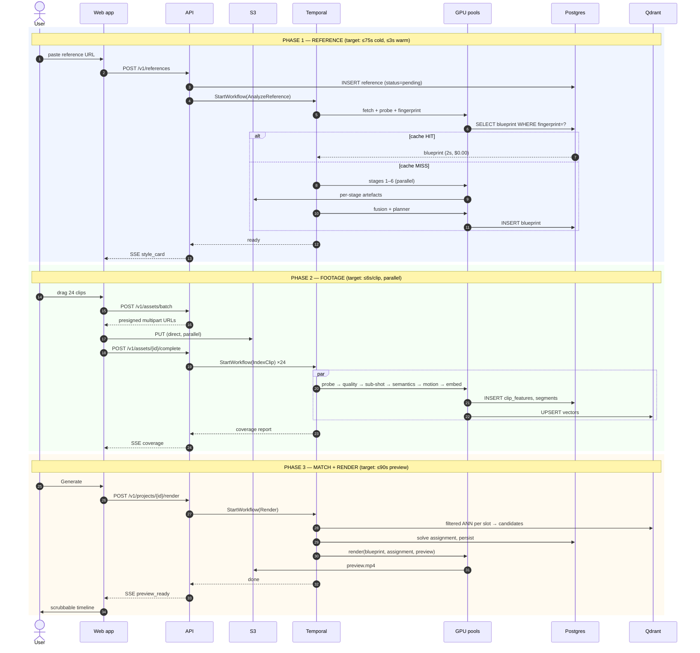
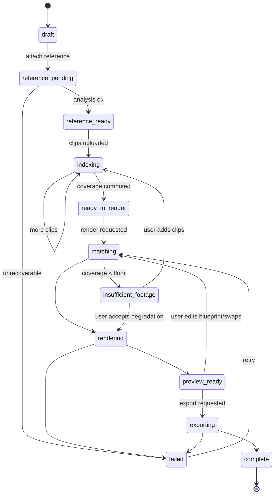

# 05 — Data Flow

A single job, traced end to end, with latency budgets, storage writes, and cost accrual at every step. This document is the reference for "where did the time go" and "where did the money go."

## 1. The whole journey



## 2. Phase 1 — Reference ingest and analysis

### 2.1 Acquisition

Two paths, and the difference is legally significant.

**File upload.** Presigned S3 multipart. The API never touches bytes. 8MB parts, browser-parallel, resumable. A 200MB reference uploads in 6–15s on a typical connection.

**URL paste.** The user provides a TikTok/Reels/Shorts URL. We fetch it **only** where the platform's terms and the applicable law permit, through a compliance layer that checks the domain against a policy table, respects `robots.txt`, and records the provenance. Where fetching is not permitted, the UI asks the user to upload the file they already have. This is a deliberate friction we accept — see [docs/18 §7](18-legal-ethics.md). Downloaded references are subject to a hard retention limit: **analysed, then deleted within 24 hours**, with only the blueprint and fingerprint retained.

### 2.2 Fingerprint and cache lookup

Before any GPU work:

```python
fingerprint = sha256(
    b"|".join([
        phash_sequence(frames_at_1fps),   # 64-bit pHash per second, concatenated
        struct.pack("d", duration_sec),
        chromaprint(audio),               # audio fingerprint
        ANALYZER_VERSION.encode(),        # invalidates on model change
    ])
)
```

Deliberately **perceptual**, not byte-level. The same TikTok downloaded twice, at different bitrates, from different mirrors, must hit the same cache entry — otherwise the entire cost model collapses, because reference re-use is exactly the case where the same *content* arrives as different *bytes*.

`ANALYZER_VERSION` in the key is mandatory. Ship a better shot-boundary detector, every old blueprint misses, everything reanalyses correctly. Omit it and you serve stale blueprints from a superseded model indefinitely, which is the kind of bug that is discovered three months later by a confused user.

**Cache hit: ~2s, $0.00 GPU.** This is the difference between a viable and non-viable business at scale.

### 2.3 Analysis fan-out

```
                       ┌──────────────────┐
                       │ Probe & demux    │  CPU, 2s
                       └────────┬─────────┘
              ┌─────────────────┼─────────────────┐
              ▼                 ▼                 ▼
      analysis proxy      motion proxy         audio
      512px @ 2fps        256px @ full fps     44.1k mono
              │                 │                 │
    ┌─────────┴──────┐          │                 │
    ▼                ▼          ▼                 ▼
  Semantics       Grade/FX    Structure         Audio
  Text/OCR                    → Motion          (Demucs → beat,
  18s + 9s        7s          6s + 12s          structure, ASR)  8s
    └────────────────┴──────────┴─────────────────┘
                       ▼
                  Fusion  CPU 3s
                       ▼
                  Planner  API 6s
                       ▼
              EDITING BLUEPRINT  (18–60 KB JSON)
```

Wall-clock is bounded by the longest chain: `probe(2) + [structure(6) → motion(12) → semantics(18)] + fusion(3) + planner(6) ≈ 47s` when parallelism is perfect. Budget is 75s to absorb queueing, cold weight loading, and variance.

**Per-stage artefacts are persisted to S3.** If semantics fails on attempt 1, attempt 2 reads the completed structure and motion artefacts and re-runs only semantics. On a pipeline this failure-prone, this converts most incidents from "re-run 47 GPU-seconds" to "re-run 18."

### 2.4 What is retained vs. discarded

| Data | Retention | Why |
|---|---|---|
| Reference video (URL-fetched) | **≤24h, then hard delete** | Legal exposure. Non-negotiable. |
| Reference video (user-uploaded) | 30d, user-deletable | It is their file |
| Extracted audio | **Deleted at end of stage 1** | Copyrighted master. Explicit, tested step. |
| Proxies | 7d | Regenerable |
| Stage artefacts | 14d | Regenerable |
| **Blueprint** | **Forever** | The corpus. Kilobytes. |
| Fingerprint | Forever | Cache key |
| Frames / thumbnails | Style-card thumbnails only, 30d | Generated from *user* footage after render, never from the reference |

The style card shows no frames from the reference. It shows the *description*. This is a product decision as much as a legal one — it reinforces to the user that they are getting a specification, not a copy.

## 3. Phase 2 — User footage

### 3.1 Upload

Batch presign, direct-to-S3, parallel. The API's role is registering rows and issuing URLs.

Client-side pre-checks before upload, because rejecting a 4GB file after upload is a terrible experience:
- Duration, resolution, codec read from the file header via `MediaSource`
- Reject >10 min or >4GB per clip on Creator tier
- Warn on non-H.264/H.265/AV1 (we will transcode, it will be slower)
- Warn on portrait/landscape mismatch against the blueprint's aspect ratio

### 3.2 Indexing fan-out

24 clips index in parallel across the indexer pool. With 6 workers at batch 4, 24 clips ≈ 6s wall-clock, not 144s. This is why the indexer pool is separate and batch-oriented: it is embarrassingly parallel and the user is watching.

**Progressive coverage.** The coverage report updates as each clip lands, so the user sees the meter climb rather than a spinner. Psychologically this matters — it is the moment the user learns the system is actually looking at their footage.

### 3.3 Coverage computation

```
for each slot in blueprint.slots:
    candidates = segments matching slot's hard constraints
                 (scale ±1 bucket, motion class compatible,
                  duration ≥ slot.duration, quality ≥ threshold)
    slot.coverage = min(1.0, len(candidates) / slot.min_candidates)

overall  = weighted mean by slot.importance
gaps     = [slot for slot in slots if slot.coverage < 0.5]
```

Gaps are rendered as **specific, actionable statements**: "3 slots need a shot with strong left-to-right motion — the style uses whip-pan transitions there." Not "insufficient footage." A user who knows what to shoot goes and shoots it; a user who gets a generic warning leaves.

## 4. Phase 3 — Match and render

### 4.1 Candidate retrieval

For each slot, a filtered ANN query against Qdrant:

```python
qdrant.search(
    collection="segments",
    query_vector=slot.semantic_vec,
    query_filter=Filter(must=[
        FieldCondition(key="project_id", match=project_id),
        FieldCondition(key="duration_ms", range=Range(gte=slot.duration_ms)),
        FieldCondition(key="quality", range=Range(gte=0.55)),
        FieldCondition(key="shot_scale", match=MatchAny(any=slot.compatible_scales)),
    ]),
    limit=40,
)
```

Filtered ANN, not post-filtered ANN. Retrieving 500 nearest neighbours and then filtering to the project's own clips would be both slow and wrong — this is the specific capability that justifies Qdrant over pgvector as volume grows ([docs/03 §3.5](03-system-architecture.md#35-data-stores)).

### 4.2 Assignment

Global constrained optimisation, not per-slot greedy. Full treatment in [docs/09](09-clip-matching.md). Output:

```json
{
  "assignments": [
    {"slot": 0, "segment_id": "seg_a1", "in_ms": 1200, "out_ms": 1980,
     "score": 0.87, "reason": "wide, static, outdoor_road, matches golden-hour tone"},
    {"slot": 1, "segment_id": "seg_c4", "in_ms": 300,  "out_ms": 920,
     "score": 0.71, "reason": "close mechanical detail; motion energy slightly low"}
  ],
  "unfilled": [],
  "reuse_count": {"seg_a1": 1, "seg_c4": 2},
  "overall_confidence": 0.79
}
```

The `reason` field is surfaced in the swap UI. Explaining the choice is what makes users trust it and what makes their corrections informative.

### 4.3 Render

Two-pass by design:

**Preview pass** — 540×960, CRF 26, no film grain, simplified effects, hardware encode. **Target ≤90s for 60s of output.** The user is waiting.

**Export pass** — full resolution, CRF 18 or target bitrate, all effects, colour-managed. Runs on `p1` priority. The user has already left the tab.

Cost accrual per render is written to the job's ledger:

```json
{
  "gpu_seconds": {"render": 62.4, "match": 0.0, "index": 41.2, "analyze": 0.0},
  "external_tokens": {"planner_in": 0, "planner_out": 0},
  "s3_put_bytes": 184_320_000,
  "cdn_egress_bytes": 12_400_000,
  "estimated_cost_usd": 0.34
}
```

`analyze: 0.0` here means a cache hit — this ledger is how [docs/14](14-cost-model.md) is measured rather than guessed.

## 5. Latency budget

| Phase | Step | p50 | p95 | Notes |
|---|---|---:|---:|---|
| Ref | Acquire | 4s | 18s | Network-bound |
| Ref | Fingerprint + lookup | 1.5s | 3s | |
| Ref | Analysis (cold) | 47s | 71s | Only on miss |
| Ref | **Total cold** | **52s** | **75s** | |
| Ref | **Total warm** | **2s** | **4s** | 55–75% of jobs |
| Clips | Upload (24 clips, 1.2GB) | 45s | 180s | Client bandwidth |
| Clips | Index (24, parallel) | 6s | 14s | Pool-depth dependent |
| Render | Candidate retrieval | 0.3s | 0.8s | |
| Render | Assignment solve | 0.6s | 2.1s | Grows with clips × slots |
| Render | Preview render | 48s | 88s | 60s output |
| Render | Export 1080p | 95s | 165s | Background |
| Render | Export 4K | 240s | 420s | Background, A10G |

**Perceived time to first preview, warm reference, 24 clips: ~57s p50.** That is the number the product lives or dies on.

## 6. State machine



Two edges deserve comment.

`preview_ready → matching` is the **iteration loop**, and it is the most-travelled path in the product. It must be cheap: a clip swap re-renders only the affected slots plus their transition neighbours, not the whole timeline. Partial re-render is described in [docs/10 §7](10-rendering-engine.md).

`insufficient_footage` is a **terminal-until-resolved** state, not a warning. The system will not silently render something bad. The user either adds footage or explicitly accepts degradation — and if they accept, the blueprint records `degraded: true` with the list of compromises, which is then visible in the export.

## 7. Data lineage

Every artefact traces to its inputs. This is what makes the system debuggable and what makes the corpus trustworthy for training.

```
reference_video (fingerprint f)
  └── blueprint b  (analyzer_version=1.4.2, planner=gemini-2.5-pro@0.2, seed=42)
        ├── project p
        │     ├── clip c1 → clip_features (indexer_version=1.2.0)
        │     │              └── segments s1..s4
        │     ├── clip c2 → …
        │     └── assignment a  (matcher_version=0.9.1)
        │           └── render r  (renderer_version=2.1.0, preset=preview)
        │                 └── output.mp4
        └── blueprint b'  (user edit, parent=b, diff=[slot7.clip, grade.contrast])
```

Every node stores the version of the component that produced it. When quality regresses, the query "which renderer version produced the renders users rejected this week" is one join, not an investigation. When we retrain the matcher, the training set is defined by lineage rather than by hoping the logs line up.

---

Next: [06 — Editing Blueprint Specification](06-blueprint-spec.md)
